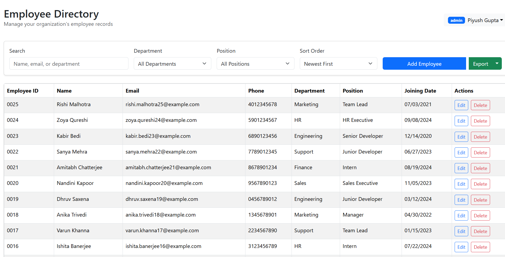
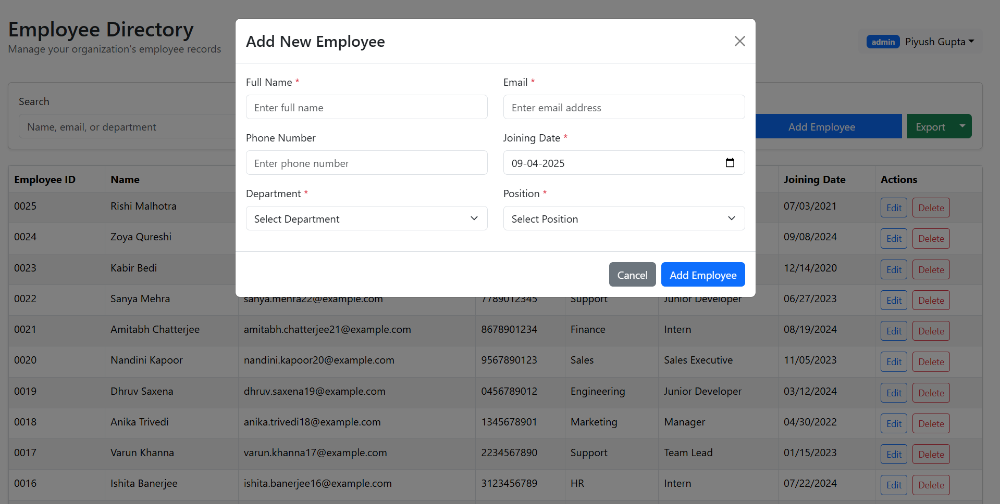
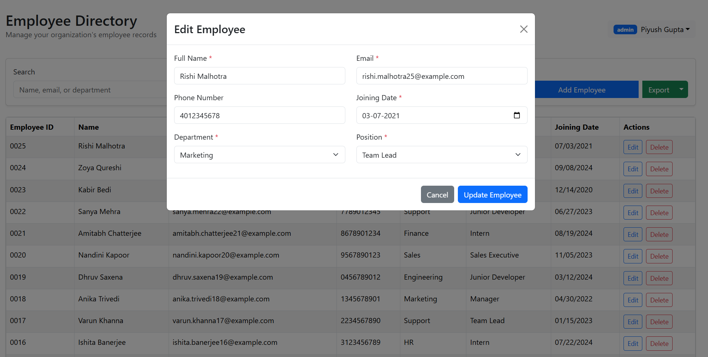

# 🗂️ Employee Directory System

A web-based system that allows organizations to manage, maintain, and explore employee records with role-based access (Admin/User). Built with a modern React UI and a robust Node.js + Express backend.

---

**Login**


---

**Dashboard**


---



---



## 🚀 Features

- 🔐 User authentication (Admin & User roles)
- 👥 Add, edit, delete employee records (Admin only)
- 🔎 Search and filter employees by name, email, department, or position
- 📄 Export employee data to CSV or JSON
- 📋 View full employee directory in a sortable table
- 🎨 Minimal black & white UI built with React Bootstrap

---

## 🧰 Tech Stack

### Frontend

- React
- React Router
- React Bootstrap
- Axios

### Backend

- Node.js
- Express.js
- MongoDB (or your chosen database)
- JWT (for auth)
- json2csv
- dotenv
- bcryptjs (for password hashing)
- cors (for cross-origin requests)

## 📂 Project Structure

## ⚙️ Setup Instructions

### 📦 Backend

1. Navigate to the `backend` folder:
   ```bash
   cd backend
   ```
2. Install dependencies:
   ```bash
   npm install
   ```
3. Add your .env file:

   ```.env
   PORT=4000
   MONGODB_URI=your-mongo-uri
   JWT_SECRET=your-secret
   ```

4. Start the server:
   ```bash
   npm run dev
   ```

### 🌐 Frontend

1. Navigate to the client folder:
   ```bash
   cd client
   ```
2. Install dependencies:
   ```bash
   npm install
   ```
3. Start the development server:
   ```bash
   npm run dev
   ```

> By default, the frontend runs on _http://localhost:5173_ and backend on _http://localhost:4000_

## 🔑 Authentication

- Users login with email & password.
- JWT is stored in cookies.
- Admins can manage data. Regular users have read-only access.

## 📡 API Endpoints (Backend)

| Method | Endpoint          | Description                     |
| ------ | ----------------- | ------------------------------- |
| POST   | /login            | Login and receive JWT token     |
| GET    | /employees        | Get all employees               |
| POST   | /employees        | Add new employee (Admin only)   |
| GET    | /employees/:id    | Get single employee details     |
| PUT    | /employees/:id    | Update employee (Admin only)    |
| DELETE | /employees/:id    | Delete employee (Admin only)    |
| GET    | /employees/export | Export employee data (CSV/JSON) |
